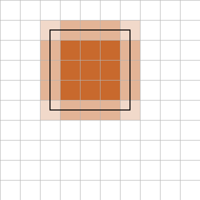

# The contract

A burn takes geometries and a grid and returns four tables. This chapter
uses one square on a 10 x 10 grid so every number can be checked by
hand.

## Input

A grid is an extent plus a column and row count; the cell size follows.
Row 1 is the top row, as in every raster format.

```rust
# extern crate controlledburn;
use controlledburn::{burn, BurnOptions, Coord, Geometry, GridSpec, Polygon};

let grid = GridSpec::new(0.0, 0.0, 10.0, 10.0, 10, 10);
assert_eq!((grid.dx(), grid.dy()), (1.0, 1.0));

// A 4 x 4 square whose corners sit at cell centres, so every boundary
// cell is exactly half (sides) or a quarter (corners) covered.
let square = Geometry::Polygon(Polygon::new(vec![vec![
    Coord::new(2.5, 4.5),
    Coord::new(6.5, 4.5),
    Coord::new(6.5, 8.5),
    Coord::new(2.5, 8.5),
    Coord::new(2.5, 4.5),
]]));

let r = burn(&[square], &grid, BurnOptions::default()).unwrap();
# assert_eq!(r.runs.len(), 3);
# assert_eq!(r.edges.len(), 16);
```

Geometry `k` in the input slice (0-based) gets `id = k + 1` in every
table, so the tables can be joined back to whatever attributes came with
the geometries.

## Output

`runs` holds the fully covered cells as inclusive column ranges:

```rust
# extern crate controlledburn;
# use controlledburn::{burn, BurnOptions, Coord, Geometry, GridSpec, Polygon};
# let grid = GridSpec::new(0.0, 0.0, 10.0, 10.0, 10, 10);
# let square = Geometry::Polygon(Polygon::new(vec![vec![Coord::new(2.5, 4.5), Coord::new(6.5, 4.5), Coord::new(6.5, 8.5), Coord::new(2.5, 8.5), Coord::new(2.5, 4.5)]]));
# let r = burn(&[square], &grid, BurnOptions::default()).unwrap();
for run in &r.runs {
    println!("row {} cols {}..={} id {}", run.row, run.col_start, run.col_end, run.id);
}
// row 3 cols 4..=6 id 1
// row 4 cols 4..=6 id 1
// row 5 cols 4..=6 id 1
# assert_eq!(r.runs.iter().map(|x| (x.row, x.col_start, x.col_end)).collect::<Vec<_>>(), vec![(3, 4, 6), (4, 4, 6), (5, 4, 6)]);
```

`edges` holds the boundary cells with the fraction of each cell's area
that the polygon covers:

```rust
# extern crate controlledburn;
# use controlledburn::{burn, BurnOptions, Coord, Geometry, GridSpec, Polygon};
# let grid = GridSpec::new(0.0, 0.0, 10.0, 10.0, 10, 10);
# let square = Geometry::Polygon(Polygon::new(vec![vec![Coord::new(2.5, 4.5), Coord::new(6.5, 4.5), Coord::new(6.5, 8.5), Coord::new(2.5, 8.5), Coord::new(2.5, 4.5)]]));
# let r = burn(&[square], &grid, BurnOptions::default()).unwrap();
let corners = r.edges.iter().filter(|e| e.fraction == 0.25).count();
let sides = r.edges.iter().filter(|e| e.fraction == 0.5).count();
assert_eq!((corners, sides), (4, 12));
```

`lines` and `points` are empty for polygon input; they are the subject
of a [later chapter](lines-and-points.md). `notes` is empty too: it
carries per-geometry problems (unparseable WKB, non-finite coordinates)
that do not stop the burn.



## The invariant

Add up the run cells and the edge fractions, multiply by the cell area,
and you have the polygon's area. This holds for any polygon that lies
inside the grid, and it is what "exact coverage" means:

```rust
# extern crate controlledburn;
# use controlledburn::{burn, BurnOptions, Coord, Geometry, GridSpec, Polygon};
# let grid = GridSpec::new(0.0, 0.0, 10.0, 10.0, 10, 10);
# let square = Geometry::Polygon(Polygon::new(vec![vec![Coord::new(2.5, 4.5), Coord::new(6.5, 4.5), Coord::new(6.5, 8.5), Coord::new(2.5, 8.5), Coord::new(2.5, 4.5)]]));
# let r = burn(&[square], &grid, BurnOptions::default()).unwrap();
let run_cells = r.run_cells() as f64;                       // 9
let edge_cells: f64 = r.edges.iter().map(|e| e.fraction as f64).sum(); // 4 * 0.25 + 12 * 0.5 = 7
let area = (run_cells + edge_cells) * grid.dx() * grid.dy();
assert_eq!(area, 16.0);
```

The same holds for an arbitrary triangle on a grid with awkward cell
sizes, to floating-point precision:

```rust
# extern crate controlledburn;
use controlledburn::{burn, signed_area, BurnOptions, Coord, Geometry, GridSpec, Polygon};

let ring = vec![Coord::new(13.3, 17.7), Coord::new(88.1, 22.4), Coord::new(41.9, 79.2), Coord::new(13.3, 17.7)];
let exact = signed_area(&ring).abs();
let grid = GridSpec::new(0.0, 0.0, 100.0, 100.0, 37, 41);
let r = burn(&[Geometry::Polygon(Polygon::new(vec![ring]))], &grid, BurnOptions::default()).unwrap();
let burned = r.covered_cells() * grid.dx() * grid.dy();
assert!((burned - exact).abs() / exact < 1e-5, "{burned} vs {exact}");
```

## What the tables are

Each table is a `Vec` of a plain `#[repr(C)]` struct with `i32` indices
and, where there is a measure, an `f32`:

| table | fields | one record means |
|---|---|---|
| `runs` | `row, col_start, col_end, id` | cells `col_start..=col_end` on `row` are fully inside geometry `id` |
| `edges` | `row, col, fraction, id` | geometry `id` covers `fraction` of cell `(row, col)`, with `0 < fraction < 1` |
| `lines` | `row, col, length, id` | geometry `id` has `length` units of line inside cell `(row, col)` |
| `points` | `row, col, id` | geometry `id` has a point in cell `(row, col)` |

That is the whole contract. There is no raster object, no CRS, no
attribute handling, and no I/O: those belong to whatever wraps the
crate.
