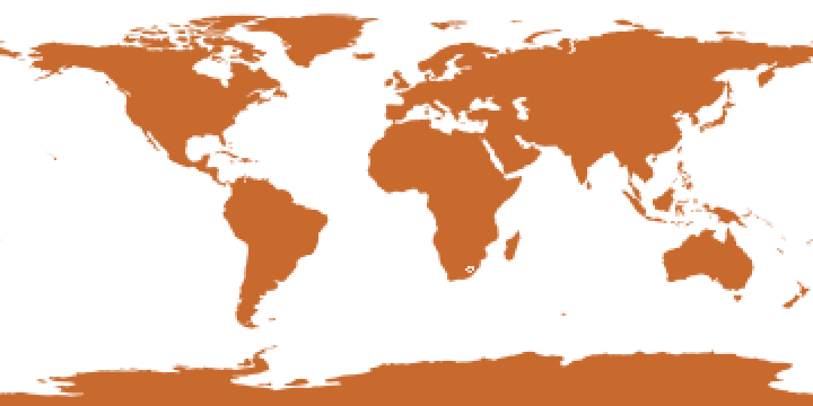

# Sparse versus dense

The argument for the four tables is easiest to make with numbers, so
this chapter burns the world's countries at three resolutions and
compares the size of the tables with the size of the dense array they
stand in for.

## The data

`data/ne_110m_countries.wkb` holds the 177 Natural Earth 110m country
polygons as plain WKB: a `u32` count, then for each feature a `u32`
length and the bytes. WKB is the interchange format of nearly every
spatial database and geometry library, so this is also the shape a
binding would pass through untouched.

```rust
# extern crate controlledburn;
# let data_dir = env!("CONTROLLEDBURN_BOOK_DATA");
let bytes = std::fs::read(format!("{data_dir}/ne_110m_countries.wkb")).unwrap();

fn split_blobs(bytes: &[u8]) -> Vec<&[u8]> {
    let n = u32::from_le_bytes(bytes[0..4].try_into().unwrap()) as usize;
    let mut pos = 4;
    let mut out = Vec::with_capacity(n);
    for _ in 0..n {
        let len = u32::from_le_bytes(bytes[pos..pos + 4].try_into().unwrap()) as usize;
        pos += 4;
        out.push(&bytes[pos..pos + len]);
        pos += len;
    }
    out
}

let countries = split_blobs(&bytes);
assert_eq!(countries.len(), 177);
```

(`data_dir` is the book's `data/` directory.)

## One degree

`burn_wkb` takes the blobs directly. The grid is the whole globe in
longitude and latitude at one degree: 360 x 180 cells.

```rust
# extern crate controlledburn;
use controlledburn::{burn_wkb, BurnOptions, GridSpec};
# let data_dir = env!("CONTROLLEDBURN_BOOK_DATA");
# let bytes = std::fs::read(format!("{data_dir}/ne_110m_countries.wkb")).unwrap();
# fn split_blobs(bytes: &[u8]) -> Vec<&[u8]> { let n = u32::from_le_bytes(bytes[0..4].try_into().unwrap()) as usize; let mut pos = 4; let mut out = Vec::with_capacity(n); for _ in 0..n { let len = u32::from_le_bytes(bytes[pos..pos + 4].try_into().unwrap()) as usize; pos += 4; out.push(&bytes[pos..pos + len]); pos += len; } out }
# let countries = split_blobs(&bytes);

let grid = GridSpec::new(-180.0, -90.0, 180.0, 90.0, 360, 180);
let r = burn_wkb(countries.iter().copied(), &grid, BurnOptions::default()).unwrap();

assert!(r.notes.is_empty());
println!("{} runs, {} edges", r.runs.len(), r.edges.len());
# assert_eq!(r.runs.len(), 1265);
# assert_eq!(r.edges.len(), 9692);

// Land fraction of the (unprojected) grid: about a third.
let land = r.covered_cells() / (360.0 * 180.0);
assert!((land - 0.3316).abs() < 0.001);
```

1,265 runs and 9,692 edges. Each record is 16 bytes, so the tables are
175 KB against 518 KB for a dense `f64` array. At this resolution the
gain is modest, because nearly every land cell is a boundary cell.



## Finer grids

The interesting part is what happens when the grid gets finer. Boundary
cells grow with the perimeter (linearly with resolution) and interior
runs grow with the number of rows, while the dense array grows with the
square.

```rust
# extern crate controlledburn;
# use controlledburn::{burn_wkb, BurnOptions, GridSpec};
# let data_dir = env!("CONTROLLEDBURN_BOOK_DATA");
# let bytes = std::fs::read(format!("{data_dir}/ne_110m_countries.wkb")).unwrap();
# fn split_blobs(bytes: &[u8]) -> Vec<&[u8]> { let n = u32::from_le_bytes(bytes[0..4].try_into().unwrap()) as usize; let mut pos = 4; let mut out = Vec::with_capacity(n); for _ in 0..n { let len = u32::from_le_bytes(bytes[pos..pos + 4].try_into().unwrap()) as usize; pos += 4; out.push(&bytes[pos..pos + len]); pos += len; } out }
# let countries = split_blobs(&bytes);
let mut rows = Vec::new();
for (ncol, nrow) in [(360u32, 180u32), (3600, 1800), (36000, 18000)] {
    let grid = GridSpec::new(-180.0, -90.0, 180.0, 90.0, ncol, nrow);
    let r = burn_wkb(countries.iter().copied(), &grid, BurnOptions::default()).unwrap();
    let sparse_bytes = (r.runs.len() + r.edges.len()) * 16;
    let dense_bytes = ncol as usize * nrow as usize * 8;
    rows.push((ncol, r.runs.len(), r.edges.len(), sparse_bytes, dense_bytes));
}
for (ncol, runs, edges, sparse, dense) in &rows {
    println!("{ncol:>6} cols: {runs:>7} runs {edges:>8} edges  {:>6.1} MB sparse  {:>7.1} MB dense", *sparse as f64 / 1e6, *dense as f64 / 1e6);
}
# assert_eq!(rows[2].1, 212765);
# assert_eq!(rows[2].2, 1064454);
# assert!(rows[2].4 / rows[2].3 > 250);
```

| cell size | cells | runs | edges | tables | dense f64 | ratio |
|---|---|---|---|---|---|---|
| 1 degree | 64,800 | 1,265 | 9,692 | 0.2 MB | 0.5 MB | 3 |
| 0.1 degree | 6.5 million | 20,555 | 105,689 | 2.0 MB | 51.8 MB | 26 |
| 0.01 degree | 648 million | 212,765 | 1,064,454 | 20.4 MB | 5,184 MB | 254 |

The last row is the point. A 0.01-degree global grid is 648 million
cells; as an `f64` array it is 5.2 GB and as `u8` it is still 648 MB,
before anything is done with it. The tables are 20 MB, the burn takes
about a quarter of a second on one core, and the 5 GB array was never
allocated. In approx mode (next chapter) the same burn is 3.4 MB and
under 20 ms.

Nothing about the tables changes with resolution except their length.
Code that consumes them at one degree consumes them at 0.01 degree
unchanged, which is what makes them a reasonable interchange format for
a rasterization service: the caller chooses the grid, and the cost of
that choice stays proportional to the geometry.
